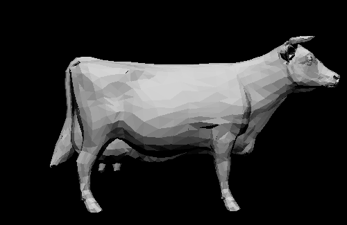

### Chron-x

Chron-x is an open source, Arduino-based, Bluetooth-enabled smartwatch that can receive notifications from your Android phone once connected via an app.

| [GitHub](https://github.com/siuryan/watch) | [Medium](https://medium.com/@ryansiu/how-to-make-your-own-smartwatch-35ff8306c160) |

---

### Augury

Augury is a web app that uses machine learning to display stock trading recommendations, based on public sentiment on Twitter.

| [GitHub](https://github.com/siuryan/augury) | [Devpost](https://devpost.com/software/augury) |

---

### GradeGuide

GradeGuide is a tool for students to visualize grade distributions for classes at the University of Michigan. I worked as a backend developer and am currently a senior software developer and project manager.

| [Website](https://gradeguide.com) |

---

### Graphics Engine

Created for a graphics class in high school, this command-based graphics engine, written in C,  generates 2D and 3D images with realistic lighting and polygon meshes. It can also take `.mdl` script files as input to generate an image, and it can create basic animations as GIFs.

| [GitHub](https://github.com/siuryan/graphics-engine) |

---

### Simplicity

Simplicity is an airline simulator game where you manage an airline company. Fly planes across the country as you try to build your fleet, and send your airplanes on the best routes to make the most money! This project was written for APCS / Data Structures and Algorithms, and implements a priority queue and Dijkstra's algorithm, amongst other data structures and algorithms.

| [GitHub](https://github.com/siuryan/Simplicity) |

---

### FIRST Tech Challenge: Stuy Fission Team 310

As the Head of Software Engineering on Stuy Fission, I created the Stuy Fission website and wrote the robot code for the '17-'18 season, Relic Recovery.
Built using Jekyll and Materialize, the website served as a portfolio and a blog. The robot code, another “relic” of my time on Stuy Fission, was developed throughout the competition season and controlled our robot's driver-controlled and autonomous movement.

| [GitHub Organization](https://github.com/fission310) | [GitHub Website](https://github.com/fission310/fission310.github.io) | [GitHub Robot](https://github.com/fission310/relic-recovery) |